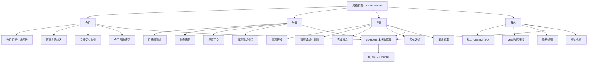

# 灵栖胶囊 Capsule iOS 首版架构

## 产品定位

iOS 版是随身捕捉入口，不复制桌面端全部面板。首版聚焦：

1. 快速保存灵感。
2. 查看今日胶囊。
3. 管理今日行动与通知。
4. 回顾历史胶囊。
5. 使用私人 CloudKit 与 Mac 同步。

## 功能结构

## 数据策略

- iPhone 使用 SwiftData 持久化。
- SwiftData 的 CloudKit 数据库使用用户私人数据库。
- 应用没有账号体系，身份由当前 Apple ID 决定。
- 离线时先写入本地，系统恢复网络后同步。
- 首次迁移使用 JSON 包导入 iPhone，再由 SwiftData 上传 CloudKit。
- Mac 持续自动同步需要后续把当前 JSON 存储适配到同一个 CloudKit schema。

## 功能边界

首版不加入付费、广告、社区、排行榜和复杂 AI 服务。主题、Widget、快捷指令、语音输入与 Apple Watch 在核心同步闭环稳定后迭代。
