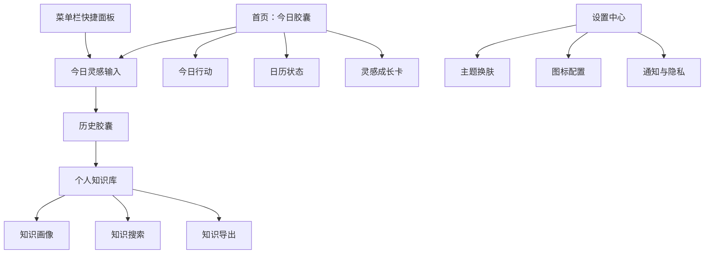

# 灵栖胶囊 Capsule 产品 PRD

版本：v1.0
日期：2026-07-02
文档用途：用于产品迭代、商业化准备、设计报价和研发排期
产品形态：macOS 本地优先桌面应用，后续扩展 iPhone 端与 iCloud/CloudKit 同步

## 1. Summary

灵栖胶囊 Capsule 是一款面向 macOS 用户的本地优先灵感记录、事项提醒与个人知识沉淀工具。它把“今日灵感”“今日行动”“历史胶囊”“个人知识库”组合成一个轻量的个人认知成长系统。

下一阶段产品目标是从“功能完整的个人工具”升级为“可长期使用、可持续沉淀、具备商业化潜力的个人知识与灵感管理产品”。核心不是继续堆功能，而是提升稳定性、数据价值、知识复用效率和跨设备连续体验。

## 2. Contacts

| 角色 | 负责人 | 职责 |
| --- | --- | --- |
| 产品负责人 | 张奥哲 | 定义产品方向、确认优先级、验收版本 |
| 产品/研发协作 | Codex | PRD、竞品分析、SwiftUI 实现、测试与构建验证 |
| UI/视觉设计师 | 待定 | 统一视觉系统、页面重构、组件规范 |
| 目标用户 | macOS 个人效率/知识沉淀用户 | 提供真实使用反馈 |

## 3. Background

### 3.1 当前产品状态

当前产品已具备以下能力：

| 模块 | 当前能力 |
| --- | --- |
| 今日胶囊 | 富文本记录、关键词提取、心情状态、Word/PDF 导出 |
| 今日行动 | 新增、完成、编辑、删除事项，支持提醒频率 |
| 日历面板 | 展示每日事项和灵感状态 |
| 顶部菜单栏 | 快速记录灵感、最近灵感、快捷入口 |
| 历史胶囊 | 按日期回看灵感、事项和总结 |
| 个人知识库 | 从历史灵感沉淀知识条目，支持搜索、分类、标签、导出 |
| 知识画像 | 趋势、类型占比、标签云、知识流 |
| 设置中心 | 主题换肤、启动图标、玻璃透明度、高斯模糊、通知与隐私说明 |
| 情绪化体验 | 欢迎语、灵感树苗成长状态、Toast 反馈 |
| 休鼾模式 | 5 分钟沉浸放松 |

### 3.2 当前核心问题

1. 产品已具备多个能力，但用户路径仍需要进一步收敛，避免“多功能工具感”过强。
2. 个人知识库已经成型，但知识条目质量、复用路径、搜索效率仍需要增强。
3. 多主题和高质量视觉素材提升了吸引力，但也增加了性能、包体和维护成本。
4. 当前商业化基础不足，需要先明确可付费价值，而不是过早上支付。
5. 如果未来做 iOS 端，同步和数据一致性需要提前定义。

### 3.3 为什么现在做

产品首个功能闭环已经成型，继续优化单点 UI 的边际收益会下降。下一阶段需要把产品从“可用”推向“可留存、可复用、可推荐、可付费”。

## 4. Objective

### 4.1 产品目标

把灵栖胶囊 Capsule 打造成一个本地优先、低干扰、具备情绪价值的个人灵感与知识沉淀工具。

### 4.2 用户目标

用户可以在 3 秒内记录灵感，在一天结束时看到自己的胶囊沉淀，并在长期使用后形成可搜索、可导出、可复用的个人知识库。

### 4.3 Key Results

| 目标 | 指标 |
| --- | --- |
| 提升记录效率 | 菜单栏记录路径控制在 3 秒内完成 |
| 提升留存 | 7 日内至少完成 3 天灵感记录 |
| 提升知识复用 | 用户能在知识库中通过搜索/筛选找到历史内容 |
| 提升稳定性 | Intel Mac 16GB、macOS 13.1 下常驻内存目标低于 150MB |
| 提升导出价值 | 今日胶囊和知识库导出 Word/PDF 格式可直接阅读 |
| 商业化准备 | 明确免费版、Pro 版边界和可付费功能池 |

## 5. Market Segment(s)

### 5.1 核心用户

| 用户类型 | 典型场景 | 核心需求 |
| --- | --- | --- |
| 产品经理/项目负责人 | 记录会议想法、需求判断、每日事项 | 快速记录、复盘、导出 |
| 设计师/创作者 | 捕捉灵感、沉淀创意、整理关键词 | 情绪化视觉、低干扰输入 |
| 知识工作者 | 长期积累工作经验、复用历史内容 | 搜索、分类、知识画像 |
| macOS 原生应用用户 | 偏好本地工具、重视隐私和系统体验 | 本地保存、原生通知、菜单栏 |

### 5.2 非核心用户

| 用户 | 不优先满足原因 |
| --- | --- |
| 团队协作用户 | 当前定位为个人工具，不做多人协作 |
| 重度项目管理用户 | 不替代 Jira、飞书项目、Notion 项目管理 |
| 重度知识图谱用户 | 不做复杂双链和插件生态 |
| 跨平台办公用户 | 首版优先 macOS/iPhone，不优先 Windows/Android |

## 6. Value Proposition(s)

### 6.1 用户价值

1. 快速记录：菜单栏输入减少打断，适合捕捉瞬时想法。
2. 本地优先：默认保存在本机，降低隐私顾虑。
3. 每日闭环：灵感、事项、总结集中在“今日胶囊”。
4. 长期沉淀：历史灵感可以形成个人知识库。
5. 情绪价值：灵感树苗、沉浸主题和轻量反馈提升长期使用意愿。
6. 可导出：Word/PDF 支持把碎片内容转成正式材料。

### 6.2 差异化价值

灵栖胶囊不试图成为 Notion 或 Obsidian 的替代品。它的定位是“更轻、更本地、更情绪化、更适合每日个人沉淀”的 macOS 胶囊工具。

## 7. Solution

### 7.1 产品信息架构

### 7.2 P0：稳定性与核心闭环

#### 7.2.1 今日胶囊稳定化

要求：
- 灵感输入、保存、自动保存、字数统计稳定。
- 导出 Word/PDF 格式清晰，包含标题、日期、正文、关键词、心情。
- 空内容、长文本、连续输入都不能造成 UI 重叠。

验收：
- 2,000 字文本输入不卡顿。
- 导出文档可直接阅读。
- 字数统计不遮挡正文。

#### 7.2.2 今日行动稳定化

要求：
- 事项支持新增、完成、编辑、删除。
- 重复事项支持每天、工作日、每周、每月。
- 日历正确显示重复事项标识。
- macOS 通知稳定触发。

验收：
- 每天/工作日事项在对应日期可见。
- 删除或取消后，后续日期不再显示错误标识。

#### 7.2.3 菜单栏快捷面板

要求：
- 面板只承担快速记录，不搬运完整主应用。
- 支持草稿保留、Command + Enter 保存、Esc 关闭。
- 保存后追加到今日胶囊，不覆盖已有内容。

验收：
- 后台/最小化时可以唤醒主应用。
- 保存后最近灵感立即刷新。

### 7.3 P1：个人知识库升级

#### 7.3.1 知识条目沉淀

要求：
- 从历史灵感自动生成知识条目。
- 支持标题、摘要、正文、分类、标签、情绪、来源日期。
- 支持人工编辑标题、分类、标签。

验收：
- 用户可以从知识流进入详情。
- 修改分类和标签后，列表和画像同步更新。

#### 7.3.2 多维搜索

要求：
- 支持关键词、分类、时间范围、情绪组合筛选。
- 筛选结果、画像统计和批量导出使用同一筛选条件。

验收：
- 搜索结果与导出结果一致。
- 空结果有明确提示。

#### 7.3.3 知识画像

要求：
- 展示时间趋势、类型占比、标签云。
- 图表不抢主视觉，核心仍是知识状态主卡和知识流。

验收：
- 用户第一眼看到知识状态卡。
- 图表作为辅助信息，视觉权重低于主卡。

### 7.4 P2：商业化基础

#### 7.4.1 免费版边界

建议免费保留：
- 今日胶囊
- 今日行动
- 菜单栏快捷记录
- 本地保存
- 基础主题
- 基础导出

#### 7.4.2 Pro 版候选功能

建议 Pro 功能池：
- 高级主题包
- 知识库批量导出
- 知识画像高级分析
- iCloud/CloudKit 跨设备同步
- 自定义启动图标高级配置
- 更多灵感树苗素材
- 高级模板和复盘报告

#### 7.4.3 不建议过早收费的功能

- 基础记录能力
- 基础事项提醒
- 基础本地保存
- 基础菜单栏输入

原因：这些是产品基础留存能力，过早收费会降低初始使用率。

## 8. Release

### 8.1 下一版本建议范围

| 优先级 | 功能 | 原因 |
| --- | --- | --- |
| P0 | 修复核心输入、导出、提醒、唤醒稳定性 | 影响日常可用性 |
| P0 | 左侧导航和主页面布局不滚动、不遮挡 | 影响第一印象 |
| P1 | 知识库详情编辑和组合筛选 | 提升知识复用价值 |
| P1 | 知识画像视觉降噪 | 避免仪表盘化 |
| P1 | 菜单栏记录体验收敛 | 高频入口必须稳定 |
| P2 | Pro 功能边界方案 | 为后续商业化做准备 |

### 8.2 后续版本

| 版本 | 目标 |
| --- | --- |
| v1.1 | 稳定核心记录、提醒、导出、知识库基础体验 |
| v1.2 | 完成知识画像、搜索增强、批量导出 |
| v1.3 | iPhone 首版 + iCloud/CloudKit 同步验证 |
| v1.4 | Pro 功能试运行，不强制支付 |
| v2.0 | 正式商业化版本 |

## 9. Risks & Assumptions

| 风险 | 影响 | 应对 |
| --- | --- | --- |
| 功能过多导致产品定位发散 | 用户不理解产品核心 | 首页和菜单栏只强化“记录与沉淀” |
| 多主题拖慢性能 | Intel 设备卡顿 | 主题资源压缩、按需加载 |
| 知识库生成质量不稳定 | 用户不信任知识沉淀 | 允许人工编辑、分类纠错 |
| 导出格式不专业 | 商业价值下降 | 建立导出模板 |
| 过早商业化 | 影响免费用户增长 | 先验证留存，再推 Pro |

## 10. Metrics

| 指标 | 说明 |
| --- | --- |
| D1/D7 留存 | 判断产品是否值得持续打开 |
| 每日灵感记录次数 | 判断快捷记录价值 |
| 今日胶囊完成率 | 判断每日闭环 |
| 知识库搜索次数 | 判断知识复用价值 |
| 导出次数 | 判断正式化输出价值 |
| 菜单栏保存成功率 | 判断高频入口稳定性 |
| 平均启动时长/内存 | 判断性能健康 |

## 11. Open Questions

1. 是否把 iCloud/CloudKit 同步作为 Pro 功能，还是免费基础能力？
2. 知识库自动生成是否需要接入本地模型或云端 AI？
3. 主题包是否作为商业化主要入口？
4. 是否需要 App Store 上架，还是先以 GitHub/DMG 分发？
5. 是否需要设计一套导出模板市场？

## 12. Reference Sources

- Notion Pricing: https://www.notion.com/pricing
- Obsidian Pricing: https://obsidian.md/pricing
- Obsidian License: https://obsidian.md/license
- Craft Pricing: https://www.craft.do/pricing
- Craft Product: https://www.craft.do/
- Things Pricing: https://culturedcode.com/things/pricing/
- Things Mac App Store: https://apps.apple.com/us/app/things-3/id904280696?mt=12
- Apple Reminders App Store: https://apps.apple.com/us/app/reminders/id1108187841
- Apple Reminders iCloud: https://support.apple.com/guide/icloud/set-up-reminders-mmbf52194b5a/icloud
- Agenda App Store: https://apps.apple.com/us/app/agenda-notes-meets-calendar/id1287445660?mt=12
- Bear Pro Pricing: https://bear.app/faq/features-and-price-of-bear-pro/
- Bear Features: https://bear.app/
