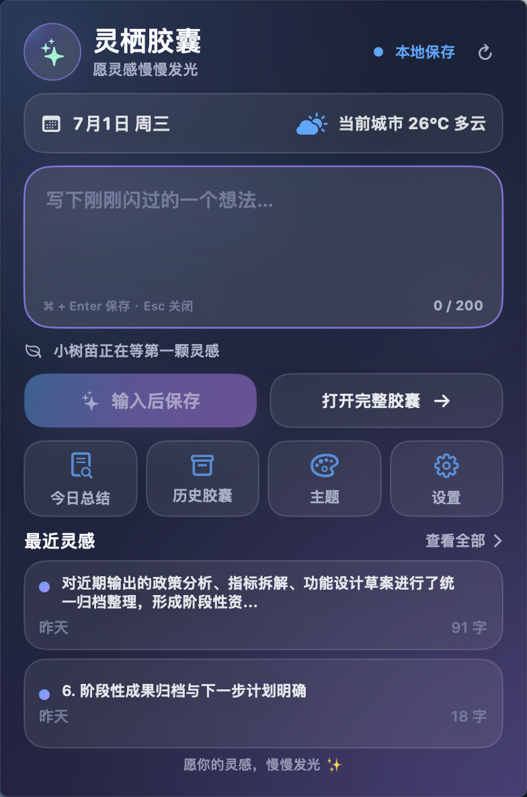
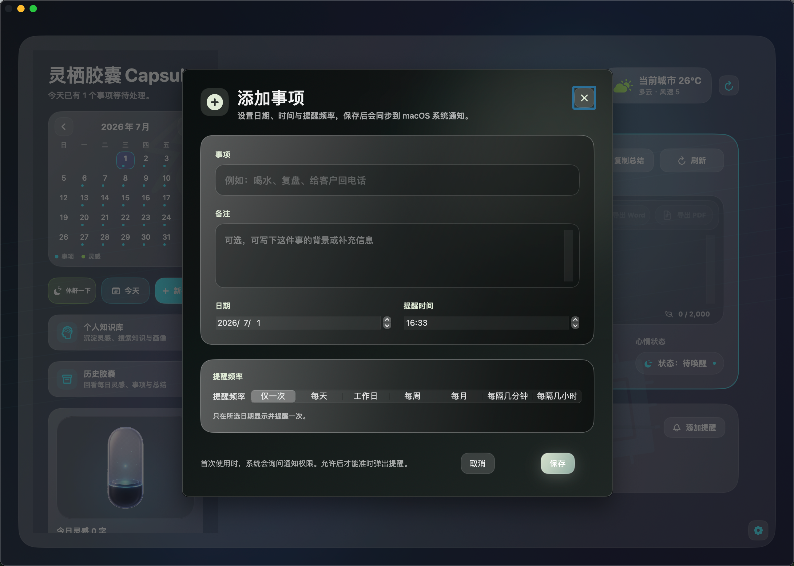
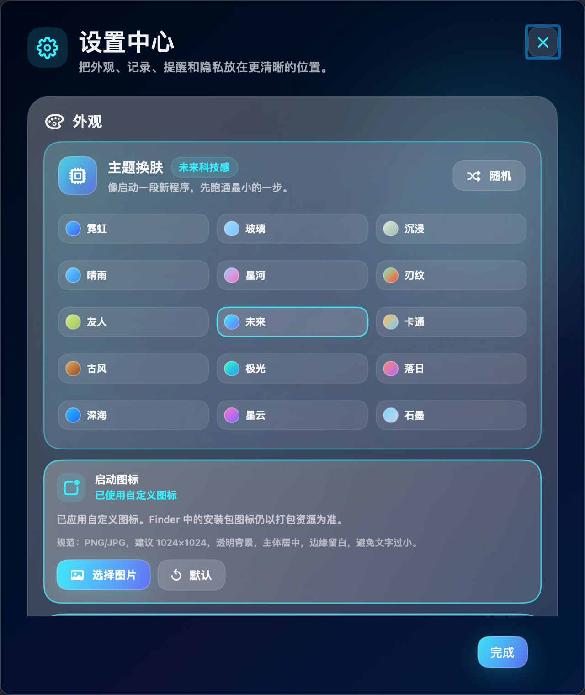
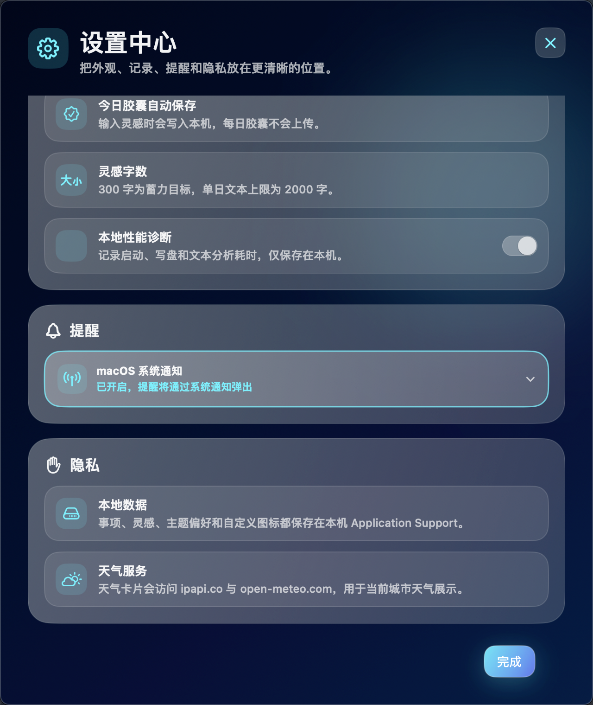

# 灵栖胶囊 Capsule 视觉迭代 PRD

版本：v1.0
日期：2026-07-01
用途：用于第三方 UI/视觉设计师报价、排期、交付对齐
产品形态：macOS 桌面应用 + 顶部状态栏快捷面板
当前阶段：功能首版已成型，进入全局视觉系统化改版

## 1. Summary

灵栖胶囊 Capsule 是一款本地优先的 macOS 灵感记录、事项提醒、个人知识沉淀工具。当前产品已具备今日胶囊、提醒事项、历史胶囊、个人知识库、菜单栏快捷输入、主题换肤、休鼾模式、天气、导出 Word/PDF 等能力。

本次视觉迭代目标不是新增业务功能，而是将现有页面从“多功能工具集合”统一升级为“高级、安静、克制、沉浸式的 macOS 个人灵感与认知成长应用”。

第三方设计师需要基于现有功能结构，完成全局视觉语言、组件规范、页面改版、状态覆盖与交付标注，最终输出可直接进入 SwiftUI 实现阶段的 Figma 设计稿与设计系统。

## 2. Contacts

| 角色 | 负责人 | 职责 |
| --- | --- | --- |
| 产品负责人 | 张奥哲 | 确认产品定位、页面范围、视觉方向、验收标准 |
| UI/视觉设计师 | 第三方待定 | 输出视觉方案、组件库、页面设计、交互状态、标注 |
| SwiftUI 开发 | Codex/开发协作方 | 基于设计稿实现 macOS SwiftUI 页面 |
| 测试验收 | 产品负责人 + 开发 | 验证页面一致性、可读性、响应式、性能风险 |

## 3. Background

### 3.1 当前已有页面与能力

当前项目已上线或已具备原型级能力，包括：

| 模块 | 已有页面/组件 | 当前作用 |
| --- | --- | --- |
| 主窗口首页 | 首页、今日胶囊、今日行动、天气、左侧日历、灵感成长卡 | 今日灵感记录、事项完成、状态概览 |
| 左侧导航 | 日历、快捷操作、历史胶囊入口、个人知识库入口、灵感成长图 | 主窗口页面切换与快捷入口 |
| 顶部菜单栏 | 菜单栏快捷输入面板 | 快速记录灵感、打开完整应用、查看最近灵感 |
| 事项提醒 | 添加事项弹窗、编辑/删除事项、提醒频率、macOS 通知 | 本地提醒与重复事项管理 |
| 历史胶囊 | 历史列表、胶囊卡片、详情面板 | 回看每日灵感、事项和总结 |
| 今日灵感 | 富文本工具栏、关键词、心情状态、Word/PDF 导出 | 记录、整理、导出当日内容 |
| 个人知识库 | 知识状态主卡、辅助洞察、标签云、知识流、搜索、导出 | 从历史灵感沉淀可复用知识 |
| 设置中心 | 主题换肤、启动图标、玻璃透明度、高斯模糊、通知、本地数据说明 | 偏好配置 |
| 主题系统 | 多套主题、沉浸背景、动漫/古风/未来/玻璃等风格 | 个性化视觉 |
| 休鼾模式 | 全屏放松页、倒计时、背景壁纸 | 5 分钟短休息 |
| 情绪化体验 | 每日欢迎弹窗、Toast、灵感树苗成长状态 | 轻量情感反馈 |
| 导出能力 | 今日胶囊 Word/PDF、知识库批量导出 | 内容沉淀与外部复用 |
| 图标资产 | App 图标、菜单栏图标、通知图标、胶囊成长素材 | 品牌识别与系统场景适配 |

### 3.2 当前视觉问题

1. 页面风格多次迭代后存在不一致：主题、弹窗、菜单栏、知识库、历史页的玻璃层级和色彩语言不完全统一。
2. 部分页面信息密度偏高，主行动不够突出，用户第一眼不容易判断下一步操作。
3. 毛玻璃透明度、背景图、文字对比度在不同主题下不稳定，存在可读性风险。
4. 卡片边界、阴影、描边缺少统一标准，部分页面卡片层级混淆。
5. 图标体系不统一，存在线性、面性、系统图标、3D 素材混用的问题。
6. 设置、主题换肤、事项弹窗、菜单栏面板等二级页面视觉完成度与首页不完全一致。
7. 多主题数量较多，但缺少标准化“主题 token”，后续维护成本高。
8. 桌面端窗口拖拽、默认尺寸、Intel 设备性能和复杂背景之间需要更明确的视觉约束。

## 4. Objective

### 4.1 产品视觉目标

将灵栖胶囊 Capsule 统一为以下视觉定位：

- macOS 原生高级感
- 深灰蓝 / 低饱和沉浸背景
- 半透明玻璃卡片
- 清晰卡片层级
- 大留白
- 克制动效
- 温和情绪反馈
- 个人灵感与认知成长感

### 4.2 业务目标

1. 让首页第一眼明确“今日胶囊”是核心。
2. 让菜单栏快捷面板成为 3 秒内记录灵感的入口。
3. 让个人知识库从“仪表盘”升级为“个人认知成长系统”。
4. 让历史胶囊、设置、提醒、主题等页面与核心视觉统一。
5. 让第三方设计交付物可直接支撑 SwiftUI 开发，减少返工。

### 4.3 非目标

本次视觉 PRD 不包含：

- 重做业务逻辑
- 新增云同步、账号、支付
- Windows/iOS 改版
- 重写数据模型
- 重做完整品牌策略
- 大规模新增动画或 3D 引擎

## 5. Market Segments

### 5.1 目标用户

| 用户类型 | 需求 | 视觉侧重点 |
| --- | --- | --- |
| 个人效率用户 | 记录待办、提醒、复盘一天 | 清晰、低干扰、快速操作 |
| 创意/产品/设计从业者 | 随手记录灵感、沉淀知识 | 情绪化、沉浸、内容可读 |
| 长期知识沉淀用户 | 从历史记录中形成可复用知识库 | 结构感、成长感、搜索与回看效率 |
| macOS 原生应用用户 | 希望应用符合系统审美 | 原生质感、规范图标、克制动效 |

### 5.2 使用场景

1. 打开主窗口，查看今天的胶囊和行动。
2. 从菜单栏快速记录一个想法。
3. 添加一个定时提醒事项。
4. 回看某天的历史胶囊。
5. 在个人知识库搜索、整理、导出知识。
6. 进入休鼾模式短暂放松。
7. 在设置中调整主题、图标、玻璃质感。

## 6. Value Propositions

### 6.1 对用户

- 用低干扰方式记录灵感和事项。
- 每日记录可以自然沉淀为知识库。
- 界面不压迫，适合长期常驻使用。
- 本地优先，数据安全感更强。
- 视觉具备情绪价值，而不是普通工具面板。

### 6.2 对产品

- 统一视觉后更利于后续商业化包装。
- 降低多主题维护成本。
- 提升截图、官网、开源仓库展示质量。
- 让第三方设计与开发协作有明确边界。

## 7. Solution

### 7.1 全局视觉原则

| 原则 | 要求 |
| --- | --- |
| 克制 | 不使用高饱和霓虹、夸张渐变、强动漫化 |
| 层级清晰 | 重要内容用更明确边界、留白、对比度表达 |
| 低干扰 | 背景图和装饰不能影响正文阅读 |
| macOS 原生感 | 窗口、圆角、阴影、控件密度符合桌面应用习惯 |
| 内容优先 | 灵感正文、事项、知识条目可读性优先于装饰 |
| 多主题可维护 | 所有主题基于 token，而不是逐页面散写颜色 |

### 7.2 推荐视觉系统

#### 7.2.1 色彩 Token

| Token | 用途 | 建议 |
| --- | --- | --- |
| Background/Base | 应用底色 | 深灰蓝、深紫蓝、低饱和绿色等 |
| Background/ImageOverlay | 背景图遮罩 | 黑色或主题色 45%-70% 遮罩 |
| Glass/L1 | 页面主容器 | opacity 0.10-0.14，边界最强 |
| Glass/L2 | 主要卡片 | opacity 0.08-0.12 |
| Glass/L3 | 次级卡片 | opacity 0.04-0.08 |
| Text/Primary | 标题、正文 | 接近白色，确保可读 |
| Text/Secondary | 说明文案 | 低对比但清晰 |
| Text/Muted | 弱提示 | 不低于可读阈值 |
| Accent/Primary | 主 CTA、选中态 | 蓝紫、青绿或主题强调色 |
| Accent/Success | 本地保存、完成 | 低饱和绿色/青色 |
| Accent/Warning | 提醒、错误 | 柔和橙红 |

#### 7.2.2 玻璃层级

| 层级 | 使用场景 | 视觉要求 |
| --- | --- | --- |
| L0 背景 | 窗口底色、壁纸 | 必须加遮罩，不能直接承载文字 |
| L1 页面容器 | 主窗口大容器、菜单栏面板 | 28-36 圆角，清晰描边 |
| L2 主卡片 | 今日胶囊、知识核心卡、事项区 | 明确边界、轻发光 |
| L3 辅助卡片 | 天气、关键词、状态、快捷入口 | 弱化，不抢主视觉 |
| L4 浮层 | 弹窗、Toast、菜单、Tooltip | 对比更高，确保可读 |

#### 7.2.3 字体层级

| 类型 | 建议字号 | 用途 |
| --- | --- | --- |
| Page Title | 32-44 | 首页日期、知识库标题 |
| Card Title | 22-30 | 今日胶囊、今日行动 |
| Section Title | 16-20 | 模块标题 |
| Body | 14-16 | 正文、事项、知识摘要 |
| Caption | 11-13 | 时间、字数、说明、状态 |
| Button | 13-16 | 按钮文案 |

#### 7.2.4 圆角与间距

| 项目 | 建议 |
| --- | --- |
| 窗口主容器圆角 | 32-44 |
| 主卡圆角 | 24-32 |
| 次卡圆角 | 18-24 |
| 胶囊标签 | 999 |
| 页面外边距 | 28-40 |
| 主模块间距 | 24-32 |
| 卡片内边距 | 20-28 |
| 小控件间距 | 8-14 |

### 7.3 页面改版范围

#### 7.3.1 主窗口首页

当前页面截图：

目标：让“今日胶囊”成为主视觉中心，今日行动为第二优先级，左侧为导航和状态辅助。

设计要求：

- 保留左侧日历，但尺寸更克制。
- 首页只突出今日胶囊和今日行动。
- 天气弱化为顶部环境状态。
- 今日胶囊输入区必须有良好可读性和编辑体验。
- 导出 Word/PDF、复制总结、刷新等操作降低视觉权重。
- 今日行动仅展示核心事项，支持编辑、删除、完成状态。
- 灵感成长卡使用 6 个成长状态素材，体现情绪价值。

需要交付：

- 默认态
- 有灵感内容态
- 空灵感态
- 长文本态
- 有事项/无事项态
- 完成事项态
- 导出按钮态
- 小窗口压缩态

#### 7.3.2 左侧栏与日历

当前页面截图：

目标：左侧栏承担导航、日历、快捷入口、灵感成长展示，不抢主内容。

设计要求：

- 日历与整体玻璃风格一致。
- 日历日期状态需支持：今日、选中、有事项、有灵感、重复事项。
- 快捷按钮一行展示：休鼾一下、今天、新事项。
- 历史胶囊、个人知识库入口保持可点击卡片样式。
- 底部灵感成长卡需要有明确视觉边界。

需要交付：

- 日历默认态
- 月份切换态
- 有标记日期态
- 快捷入口 hover/press/disabled
- 左侧滚动或固定布局规则

#### 7.3.3 顶部状态栏快捷面板

当前页面截图：

目标：3 秒内完成灵感记录，不做完整首页复制。

设计要求：

- 面板宽度建议 400-420，高度 650-720。
- 输入区和保存按钮是唯一主行动。
- 最近灵感只展示 2 条。
- 快捷入口：今日总结、历史胶囊、主题、设置。
- 本地保存状态不能写成“已同步”。
- 支持草稿、Command + Enter、Esc、Command + O 的视觉提示。

需要交付：

- 空输入态
- 输入中态
- 保存成功态
- 保存失败轻提示
- 最近灵感空态/有数据态
- 快捷入口 hover 态
- 菜单栏图标打开态

#### 7.3.4 添加/编辑事项弹窗

当前页面截图：

目标：让提醒创建更轻，不拥挤，符合表单相近性原则。

设计要求：

- 标题区、内容区、频率区、底部操作区分层清晰。
- 输入框高度与留白优化。
- 日期/时间控件保持 macOS 可用性。
- 重复频率支持：仅一次、每天、工作日、每周、每月、每隔几分钟、每隔几小时。
- 底部取消/保存按钮相近、大小合理。
- 避免系统默认蓝色 focus 样式破坏主题。

需要交付：

- 新增态
- 编辑态
- 删除确认态
- 重复事项说明态
- 通知未授权提示态
- 输入错误态

#### 7.3.5 历史胶囊页

当前截图状态：

> 本轮未提供独立历史胶囊页截图。该模块仍作为 P1 必做页面纳入设计报价，后续需补充历史列表页、历史详情页截图或由设计师按本文档范围补画。

目标：从普通列表升级为“时间胶囊回看”。

设计要求：

- 支持按日期/月分组。
- 每张卡片展示日期、摘要、关键词、完成度、状态。
- 不在列表页展示完整正文。
- 点击进入详情面板。
- 详情支持回看灵感、事项、总结、导出。

需要交付：

- 历史列表页
- 空历史页
- 历史详情页
- 按月份分组视觉
- 筛选/返回今日入口

#### 7.3.6 个人知识库页

当前页面截图：

目标：升级为“个人认知成长系统”，避免仪表盘平铺。

设计要求：

- KnowledgeCoreCard 是第一视觉焦点。
- 显示知识状态：idle / active / growing / saturated。
- 显示今日沉淀字数、增长率、关键词、唯一 CTA“继续沉淀知识”。
- TrendMiniChart、TypeBarChart、TagCloudView 为辅助洞察，不成为视觉中心。
- KnowledgeFeedCard 展示标题、摘要、时间、标签，hover 显示复用/编辑/查看。
- 卡片边界必须清晰，避免与背景图混淆。

需要交付：

- 知识库首页
- 空知识库态
- 搜索有结果/无结果
- 筛选状态
- 知识状态四态
- Feed hover 操作态
- 长标签换行规则

#### 7.3.7 知识详情页

当前截图状态：

> 本轮未提供独立知识详情页截图。该模块仍需纳入报价，设计时需要基于知识流卡片点击后的详情阅读、标签编辑、分类修改、导出操作进行补全。

目标：支持完整阅读、标签编辑、人工分类修改和复用。

设计要求：

- 正文阅读优先，排版接近阅读器。
- 分类、标签、来源日期、字数、情绪状态清晰展示。
- 编辑标签与人工改分类的入口明确但不干扰阅读。
- 支持导出 Word/PDF 或复制正文。

需要交付：

- 阅读态
- 编辑标签态
- 改分类态
- 导出/复制成功提示
- 长正文滚动态

#### 7.3.8 设置中心

当前页面截图：

目标：分组偏好中心，不堆叠配置。

设计要求：

- 分为：外观、记录、提醒、隐私/本地数据。
- 主题换肤放在外观组。
- 启动图标、卡片透明度、高斯模糊值放在外观组。
- 通知授权放在提醒组。
- 本地保存说明放在隐私组。
- 设置弹窗需要有清晰边界、滚动容器、底部完成按钮。

需要交付：

- 设置首页
- 主题换肤展开态
- 图标配置态
- 滑块操作态
- 通知授权态
- 本地数据说明态

#### 7.3.9 主题换肤

当前页面截图：

目标：多主题保持个性，但视觉 token 统一。

设计要求：

- 主题卡片展示主题名、色彩、背景预览、情绪文案。
- 支持当前主题选中态。
- 主题数量多时要有可扫描布局。
- 每套主题需定义：背景、卡片、描边、文字、强调色、按钮、图标、插画/背景。

需要交付主题：

- 沉浸
- 玻璃 / iOS 毛玻璃
- 未来科技感
- 卡通风格
- 古风风格
- 天气之子
- 你的名字
- 鬼灭之刃
- 夏目友人帐
- 其他当前已内置主题

说明：涉及动漫 IP 的主题需要注意版权风险。若面向公开商业发布，建议设计为“氛围灵感主题”，避免直接使用受版权保护的角色、名称和可识别元素。

#### 7.3.10 休鼾模式

当前截图状态：

> 本轮未提供休鼾模式全屏页截图。该模块仍需纳入报价，重点补充启动入口、全屏倒计时、主动退出和结束返回状态。

目标：短暂休息的沉浸式全屏页。

设计要求：

- 5 分钟倒计时。
- 柔和壁纸、低对比文字、轻线条。
- 支持主动退出。
- 退出不关闭主应用。
- 内容随机但风格统一。

需要交付：

- 休鼾启动入口
- 全屏休息页
- 倒计时态
- 即将结束态
- 主动退出态

#### 7.3.11 欢迎语 / 情绪化弹窗 / Toast

当前截图状态：

> 本轮未提供欢迎语弹窗或 Toast 截图。该模块仍需纳入报价，重点补充每日欢迎弹窗、保存成功、导出成功、错误轻提示和空状态文案。

目标：温柔提示，不影响操作。

设计要求：

- 欢迎弹窗可读性优先，背景遮罩不能过透明。
- 情绪文案短、克制。
- 支持自动关闭倒计时。
- Toast 不使用系统 Alert。

需要交付：

- 每日欢迎弹窗
- 保存成功 Toast
- 导出成功 Toast
- 错误轻提示
- 空状态情绪文案

#### 7.3.12 图标与资产

当前页面截图：

目标：符合 macOS 生态规范。

设计要求：

- App 启动图标视觉大小与系统应用一致。
- 菜单栏图标固定使用一套面性图标，不随页面状态频繁变化。
- 通知图标、Dock 图标、Finder 图标一致。
- 灵感成长素材 6 个状态保留透明背景，可用于页面展示。
- 背景壁纸需压缩并考虑性能，不让包体过大。

需要交付：

- AppIcon 完整尺寸源文件
- 菜单栏图标 1x/2x/3x 或 PDF vector
- 通知图标
- 6 个灵感成长状态
- 背景图使用规范

### 7.4 组件库交付范围

第三方设计师需要在 Figma 中输出以下组件：

| 组件 | 状态 |
| --- | --- |
| GlassCard L1/L2/L3/L4 | default / hover / active / disabled |
| PrimaryButton | default / hover / pressed / disabled / loading / success |
| SecondaryButton | default / hover / pressed / disabled |
| IconButton | default / hover / active |
| CapsuleTag | default / selected / overflow |
| CalendarDayCell | today / selected / hasReminder / hasInspiration / repeated |
| TextInput / TextEditor | empty / focus / filled / error / long content |
| Modal | default / scroll / close hover |
| Toast | success / warning / error |
| ReminderRow | incomplete / complete / hover edit-delete |
| KnowledgeFeedCard | default / hover actions |
| ThemeSwatch | default / selected / hover |
| MenuBarPanel | open / compact-height fallback |

### 7.5 交互与动效要求

1. 动效只用于状态反馈，不做夸张装饰。
2. hover：轻微提亮、边框增强、阴影增强。
3. 点击：0.12-0.18s 轻压反馈。
4. 页面切换：0.20-0.35s opacity + y offset。
5. 保存成功：按钮短暂变为成功态，Toast 1.2-1.8s 自动消失。
6. 灵感成长：阶段变化时轻微 glow + scale，不做游戏化养成。
7. 休鼾模式：慢速背景呼吸感，但不能影响性能。

### 7.6 响应式与窗口规则

| 场景 | 要求 |
| --- | --- |
| 默认窗口 | 1291 x 893 px，元素无遮挡 |
| 横向拖拽 | 主内容卡片自适应，按钮不换行错位 |
| 纵向拖拽 | 主要内容可滚动，底部设置按钮不遮挡 |
| 菜单栏面板 | 默认 400-420 px 宽，屏幕不足时内部滚动 |
| Intel Mac | 避免大面积实时 blur 和过重动画 |
| M 系列 Mac | 视觉一致，不额外使用高性能专属效果 |

### 7.7 设计交付物

设计师报价需包含以下交付物：

1. Figma 源文件。
2. 全局视觉方向 2-3 套探索方案。
3. 最终 Design Tokens。
4. 组件库。
5. 全量页面设计稿。
6. 关键交互原型。
7. Hover / Focus / Disabled / Empty / Error / Success 状态。
8. 图标与资产导出包。
9. SwiftUI 开发标注。
10. 设计走查修改 1-2 轮。

建议 Figma 文件结构：

1. Cover
2. Product Context
3. Design Tokens
4. Components
5. Main Window
6. Menu Bar Panel
7. Reminder Modal
8. History Capsules
9. Knowledge Base
10. Settings
11. Themes
12. Rest Mode
13. Icon & Assets
14. Interaction States
15. Handoff Notes

### 7.8 报价拆分建议

请第三方按以下模块拆报价：

| 阶段 | 工作内容 | 交付 |
| --- | --- | --- |
| Phase 1 视觉探索 | 2-3 套方向：首页 + 菜单栏核心样张 | 风格提案 |
| Phase 2 设计系统 | 色彩、字体、圆角、玻璃层级、按钮、图标规则 | Design Tokens + Components |
| Phase 3 核心页面 | 首页、菜单栏、事项弹窗、知识库 | 高保真页面 |
| Phase 4 全页面覆盖 | 历史、设置、主题、休鼾、欢迎弹窗、状态组件 | 全量页面 |
| Phase 5 标注与走查 | 标注、切图、交互说明、开发答疑 | Handoff |

报价需单独列出：

- 页面设计费用
- 组件库费用
- 图标/插画/素材费用
- 动效原型费用
- 额外主题扩展费用
- 修改轮次
- 交付周期

## 8. Release

### 8.1 设计验收标准

1. 首页第一眼能识别“今日胶囊”为核心。
2. 菜单栏面板能在 3 秒内完成灵感记录。
3. 个人知识库第一眼能感知“知识正在成长”。
4. 所有核心页面视觉统一，不再像多个版本拼接。
5. 玻璃层级清晰，卡片边界明确。
6. 背景图不影响正文阅读。
7. 字体、按钮、图标、标签、输入框、弹窗有统一组件规范。
8. 所有主题使用同一套 token 结构。
9. Hover、Focus、Disabled、Empty、Error、Success 状态齐全。
10. 默认窗口 1291 x 893 px 下元素无遮挡。
11. 菜单栏面板在小屏幕可滚动，不溢出。
12. 视觉方案不依赖重型动画，不增加明显性能风险。

### 8.2 开发验收辅助标准

设计稿需要让开发能明确判断：

- 每个颜色 token 的用途。
- 每个卡片属于 L1/L2/L3/L4 哪一层。
- 背景遮罩透明度。
- 所有按钮状态。
- 输入框内边距、光标位置、字数统计位置。
- 日历状态优先级。
- 弹窗最大高度和滚动区域。
- 图标尺寸和导出格式。
- 多主题如何映射到 token。

### 8.3 风险与约束

| 风险 | 说明 | 设计约束 |
| --- | --- | --- |
| 毛玻璃性能 | Intel Mac 下大面积 blur 可能影响最小化/恢复动画 | 避免全屏多层实时 blur，优先用静态遮罩和低层级材质 |
| 文字可读性 | 背景图复杂时文字易失焦 | 所有文字区域必须有遮罩或卡片底 |
| 多主题维护 | 主题过多会导致样式失控 | 必须基于 token，不允许每页独立配色 |
| 动漫主题版权 | 直接使用 IP 形象有商业风险 | 改为氛围化主题，不使用可识别角色 |
| 图标大小 | macOS Launchpad/Dock 中视觉尺寸需统一 | 图标主体需保留足够安全边距 |
| 页面复杂度 | 功能多，容易回到工具堆叠 | 核心页面必须限制主行动数量 |

### 8.4 第三方报价反馈模板

请第三方设计师报价时提供：

1. 总报价与分阶段报价。
2. 预计工期。
3. 每阶段交付物。
4. 包含多少页面与状态。
5. 是否包含组件库。
6. 是否包含图标/插画/背景资产处理。
7. 是否包含交互原型。
8. 修改轮次。
9. 是否提供 SwiftUI 友好的标注。
10. 过往 macOS / 桌面应用案例。

## 附录 A：页面清单汇总

| 优先级 | 页面/模块 | 是否必须设计 | 说明 |
| --- | --- | --- | --- |
| P0 | 主窗口首页 | 是 | 产品核心页面 |
| P0 | 今日胶囊主卡 | 是 | 核心输入与沉淀 |
| P0 | 今日行动 | 是 | 事项核心 |
| P0 | 左侧栏 + 日历 | 是 | 高频导航 |
| P0 | 菜单栏快捷面板 | 是 | 高频快捷入口 |
| P0 | 添加/编辑事项弹窗 | 是 | 高频任务创建 |
| P0 | 设置中心 | 是 | 影响全局偏好 |
| P0 | 主题换肤 | 是 | 视觉系统核心 |
| P1 | 历史胶囊页 | 是 | 内容回看 |
| P1 | 历史详情页 | 是 | 详情阅读与导出 |
| P1 | 个人知识库页 | 是 | 下阶段核心能力 |
| P1 | 知识详情页 | 是 | 阅读与编辑 |
| P1 | 欢迎弹窗 / Toast | 是 | 情绪化体验 |
| P1 | 休鼾模式 | 是 | 特色体验 |
| P1 | 导出状态 | 是 | Word/PDF 操作反馈 |
| P2 | 空状态集合 | 是 | 新用户体验 |
| P2 | 通知权限状态 | 是 | macOS 权限场景 |
| P2 | 图标配置 | 是 | 设置子模块 |
| P2 | 错误/失败状态 | 是 | 稳定性体验 |

## 附录 B：报价边界说明

本 PRD 用于视觉与交互设计报价，不包含代码实现报价。设计师可基于本清单评估页面数量、组件数量、状态数量和交互复杂度。若设计师只报价单页视觉，需要明确不包含组件库、多主题、状态、动效、标注和开发走查。

## 附录 C：现状截图索引

| 模块 | 对应截图 | 覆盖状态 | 备注 |
| --- | --- | --- | --- |
| 主窗口首页 | `visual-prd-screenshots/user-provided/01-main-home-current.png` | 已附 | 覆盖首页、今日胶囊、今日行动、天气、左侧栏、日历、灵感成长卡。 |
| 左侧栏与日历 | `visual-prd-screenshots/user-provided/01-main-home-current.png` | 已附 | 与首页共用截图，后续可补充左侧栏局部交互态。 |
| 添加/编辑事项弹窗 | `visual-prd-screenshots/user-provided/02-reminder-editor-current.png` | 已附 | 覆盖新增事项表单、频率选择、底部操作按钮。 |
| 个人知识库总览 | `visual-prd-screenshots/user-provided/03-knowledge-overview-current.png` | 已附 | 覆盖 KnowledgeCoreCard、辅助洞察、标签云。 |
| 知识流列表 | `visual-prd-screenshots/user-provided/04-knowledge-feed-current.png` | 已附 | 覆盖知识流列表卡片。 |
| 知识流 Hover 操作态 | `visual-prd-screenshots/user-provided/05-knowledge-feed-hover-current.png` | 已附 | 覆盖卡片 hover 时复用、编辑、查看入口。 |
| 顶部状态栏快捷面板 | `visual-prd-screenshots/user-provided/06-menubar-panel-current.png` | 已附 | 覆盖菜单栏快速输入、快捷入口、最近灵感。 |
| 设置中心：外观/主题/图标 | `visual-prd-screenshots/user-provided/07-settings-appearance-current.png` | 已附 | 覆盖主题换肤、启动图标配置、外观设置。 |
| 设置中心：记录/提醒/隐私 | `visual-prd-screenshots/user-provided/08-settings-record-reminder-privacy-current.png` | 已附 | 覆盖自动保存、本地诊断、系统通知、本地数据、天气服务说明。 |
| 历史胶囊页 | 暂无 | 待补充 | 需要补充历史列表、历史详情、月份分组、筛选入口。 |
| 知识详情页 | 暂无 | 待补充 | 需要补充正文阅读、标签编辑、人工分类、导出状态。 |
| 休鼾模式 | 暂无 | 待补充 | 需要补充全屏倒计时、退出、结束状态。 |
| 欢迎语 / Toast | 暂无 | 待补充 | 需要补充每日欢迎弹窗、保存成功、导出成功、错误提示。 |
| 图标与资产 | `visual-prd-screenshots/user-provided/07-settings-appearance-current.png` | 部分覆盖 | 已覆盖设置中的启动图标配置；仍需补 Dock、Finder、菜单栏、通知图标独立预览。 |
